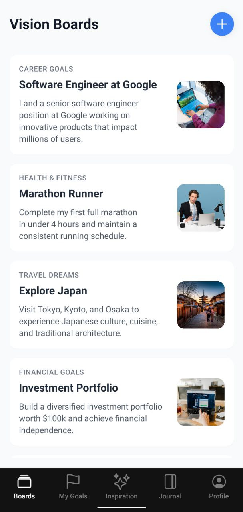
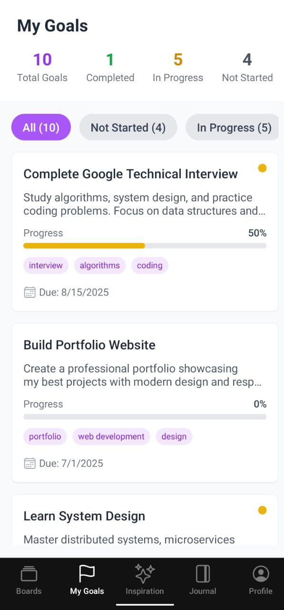
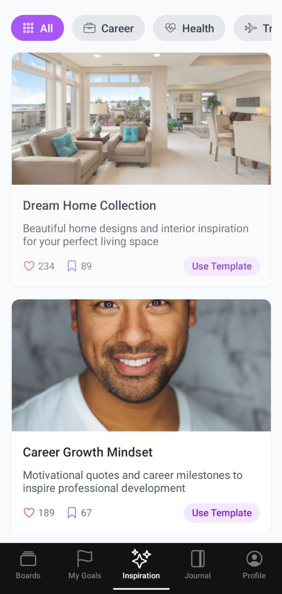
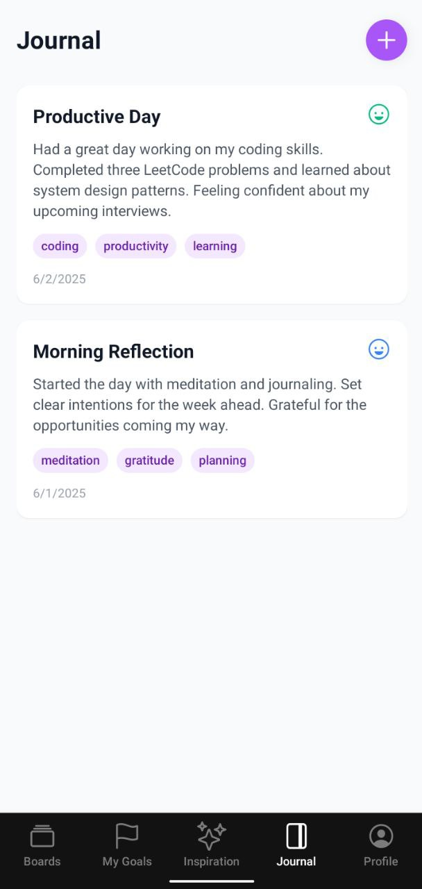
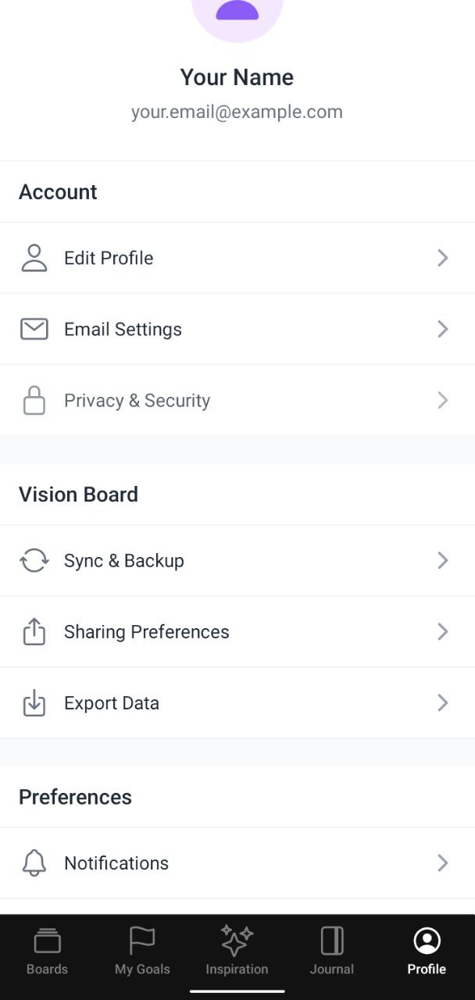

# Vision Board Mobile App 📱✨

A mobile application built with Expo and React Native that helps users visualize their goals and aspirations through digital vision boards.

<!--  -->
<!--  -->






## 🌟 Features

- **Create Vision Boards**: Organize your goals into dedicated boards
- **Track Progress**: Monitor your journey with progress indicators for each goal
- **Rich Media**: Add images, descriptions, and deadlines to your vision entries
- **Categorize & Tag**: Use tags to categorize your aspirations
- **Daily Inspiration**: Get motivated with daily inspiration quotes
- **Explore Templates**: Browse templates and ideas for your vision boards
- **Offline Support**: Access your vision boards anywhere, even offline

## 📋 Project Structure

- `/app` - The main application screens using file-based routing
  - `/(tabs)` - Main tab navigation (Boards, Goals, Inspiration, Journal, Profile)
  - `/boards` - Board detail screens
- `/components` - Reusable UI components
  - `/boards` - Components for board details and entries
  - `/goals` - Components for goal tracking
  - `/inspiration` - Components for inspiration and templates
  - `/ui` - Generic UI components
- `/data` - Sample data structures and dummy content
- `/hooks` - Custom React hooks
- `/store` - Zustand stores for state management
- `/utils` - Utility functions
- `/docs` - Project documentation

## 🚀 Getting Started

### Prerequisites

- Node.js (v18 or higher)
- npm or yarn
- Expo CLI (`npm install -g expo-cli`)
- iOS Simulator or Android Emulator (optional)

### Installation

1. Clone the repository

   ```powershell
   git clone https://github.com/yourusername/vision-board-mobile.git
   cd vision-board-mobile
   ```

2. Install dependencies

   ```powershell
   npm install
   ```

3. Start the development server

   ```powershell
   npx expo start
   ```

4. Open the app on your device or emulator
   - Press `a` for Android
   - Press `i` for iOS
   - Scan the QR code with the Expo Go app on your physical device

## 🔧 Technologies

- **Expo & React Native**: Core app framework
- **TypeScript**: For type safety
- **NativeWind**: Tailwind CSS for React Native
- **Expo Router**: File-based routing
- **Zustand**: State management
- **React Native Reanimated**: Animations

## 🔜 Coming Soon

- Authentication system
- Cloud synchronization
- Push notifications for reminders
- Drag-and-drop board layout
- AI-powered goal suggestions
- Social sharing features
- Export to PDF/Image

## 📄 License

This project is licensed under the MIT License - see the LICENSE file for details.

---

Built with ❤️ using [Expo](https://expo.dev)
